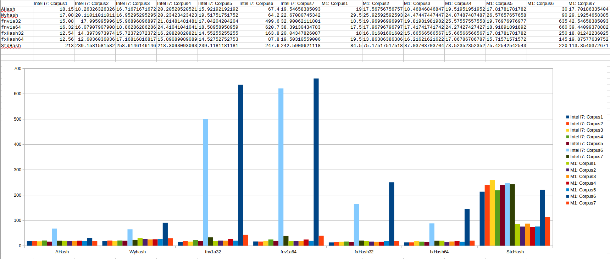
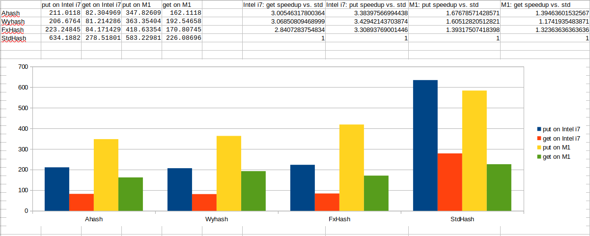

# mojo-hash
A collection of hash functions implemented in Mojo.

## AHash
Original repo: https://github.com/tkaitchuck/aHash 
Note: implements the fallback version (without AES-NI intrinsics use), uses folded multiply function without u128 support

## fnv1a
Original repo: https://github.com/ziglang/zig/blob/master/lib/std/hash/fnv.zig
Note: implements 32 and 64 bit variants

## fxhash
Original repo: https://github.com/cbreeden/fxhash/tree/master
Note: implements 32 and 64 bit variants

## Wyhash
Original repo: https://github.com/wangyi-fudan/wyhash
Note: `wymum` implemented as if `WYHASH_32BIT_MUM` is set and `WYHASH_CONDOM` not set. Little endian only.

## Benachmark
Collecets average hash function runtime in nanoseconds based on 7 different word collections. The average runtime is computed 20 times on each word collection, the fastest is kept as final result. Shows collision on full 32/64 bit space and 1024 mod (10 bit) space

### Results

CPU Specs: 11th Gen Intel(R) Core(TM) i7-1165G7 @ 2.80GHz

```
Corpus 1
Word count 100 | unique word count 82 | min key size 2 | avg key size 5.71 | max key size 12
AHash avg hash compute 18.149999999999999 | hash colision 1.0 | hash colision mod 512 1.1549295774647887
Wyhash avg hash compute 17.079999999999998 | hash colision 1.0 | hash colision mod 512 1.1232876712328768
fnv1a32 avg hash compute 15.08 | hash colision 1.0 | hash colision mod 512 1.1232876712328768
fnv1a64 avg hash compute 16.32 | hash colision 1.0 | hash colision mod 512 1.0249999999999999
fxHash32 avg hash compute 12.539999999999999 | hash colision 1.0 | hash colision mod 512 1.2238805970149254
fxHash64 avg hash compute 12.56 | hash colision 1.0 | hash colision mod 512 1.1884057971014492
std_Hash64 avg hash compute 213.0 | hash colision 1.0 | hash colision mod 512 1.0512820512820513

Corpus 2
Word count 999 | unique word count 203 | min key size 1 | avg key size 4.8058058058058055 | max key size 14
AHash avg hash compute 18.263263263263262 | hash colision 1.0 | hash colision mod 512 1.2083333333333333
Wyhash avg hash compute 20.11011011011011 | hash colision 1.0 | hash colision mod 512 1.2303030303030302
fnv1a32 avg hash compute 17.995995995995997 | hash colision 1.0 | hash colision mod 512 1.2848101265822784
fnv1a64 avg hash compute 16.079079079079079 | hash colision 1.0 | hash colision mod 512 1.2011834319526626
fxHash32 avg hash compute 14.397397397397397 | hash colision 1.0 | hash colision mod 512 1.3716216216216217
fxHash64 avg hash compute 12.603603603603604 | hash colision 1.0 | hash colision mod 512 1.4195804195804196
std_Hash64 avg hash compute 239.15815815815816 | hash colision 1.0 | hash colision mod 512 1.2303030303030302

Corpus 3
Word count 999 | unique word count 192 | min key size 1 | avg key size 4.293293293293293 | max key size 13
AHash avg hash compute 16.716716716716718 | hash colision 1.0 | hash colision mod 512 1.1636363636363636
Wyhash avg hash compute 16.952952952952952 | hash colision 1.0 | hash colision mod 512 1.2151898734177216
fnv1a32 avg hash compute 15.968968968968969 | hash colision 1.0 | hash colision mod 512 1.1428571428571428
fnv1a64 avg hash compute 18.862862862862862 | hash colision 1.0 | hash colision mod 512 1.2229299363057324
fxHash32 avg hash compute 15.723723723723724 | hash colision 1.0 | hash colision mod 512 1.352112676056338
fxHash64 avg hash compute 17.168168168168169 | hash colision 1.0 | hash colision mod 512 1.4436090225563909
std_Hash64 avg hash compute 258.6146146146146 | hash colision 1.0 | hash colision mod 512 1.1779141104294479

Corpus 4
Word count 999 | unique word count 532 | min key size 2 | avg key size 10.646646646646646 | max key size 37
AHash avg hash compute 20.205205205205207 | hash colision 1.0 | hash colision mod 512 1.5786350148367954
Wyhash avg hash compute 20.234234234234233 | hash colision 1.0 | hash colision mod 512 1.5975975975975976
fnv1a32 avg hash compute 21.814814814814813 | hash colision 1.0 | hash colision mod 512 1.6170212765957446
fnv1a64 avg hash compute 24.41041041041041 | hash colision 1.0 | hash colision mod 512 1.5928143712574849
fxHash32 avg hash compute 16.208208208208209 | hash colision 1.0 | hash colision mod 512 1.6677115987460815
fxHash64 avg hash compute 15.890890890890891 | hash colision 1.0 | hash colision mod 512 1.9850746268656716
std_Hash64 avg hash compute 218.3093093093093 | hash colision 1.0018832391713748 | hash colision mod 512 1.6170212765957446

Corpus 5
Word count 999 | unique word count 208 | min key size 2 | avg key size 5.6496496496496498 | max key size 18
AHash avg hash compute 15.921921921921921 | hash colision 1.0 | hash colision mod 512 1.1620111731843576
Wyhash avg hash compute 19.517517517517518 | hash colision 1.0 | hash colision mod 512 1.1685393258426966
fnv1a32 avg hash compute 17.042042042042041 | hash colision 1.0 | hash colision mod 512 1.2093023255813953
fnv1a64 avg hash compute 18.58958958958959 | hash colision 1.0 | hash colision mod 512 1.2530120481927711
fxHash32 avg hash compute 14.552552552552553 | hash colision 1.0 | hash colision mod 512 1.3506493506493507
fxHash64 avg hash compute 14.527527527527528 | hash colision 1.0 | hash colision mod 512 1.3594771241830066
std_Hash64 avg hash compute 239.1181181181181 | hash colision 1.0 | hash colision mod 512 1.2023121387283238

Corpus 6
Word count 10 | unique word count 10 | min key size 378 | avg key size 499.19999999999999 | max key size 558
AHash avg hash compute 67.400000000000006 | hash colision 1.0 | hash colision mod 512 1.0
Wyhash avg hash compute 64.200000000000003 | hash colision 1.0 | hash colision mod 512 1.0
fnv1a32 avg hash compute 499.60000000000002 | hash colision 1.0 | hash colision mod 512 1.0
fnv1a64 avg hash compute 620.70000000000005 | hash colision 1.0 | hash colision mod 512 1.0
fxHash32 avg hash compute 163.80000000000001 | hash colision 1.0 | hash colision mod 512 1.0
fxHash64 avg hash compute 87.799999999999997 | hash colision 1.0 | hash colision mod 512 1.0
std_Hash64 avg hash compute 247.59999999999999 | hash colision 1.0 | hash colision mod 512 1.0

Corpus 7
Word count 161 | unique word count 143 | min key size 8 | avg key size 22.260869565217391 | max key size 43
AHash avg hash compute 19.546583850931675 | hash colision 1.0 | hash colision mod 512 1.1259842519685039
Wyhash avg hash compute 22.670807453416149 | hash colision 1.0 | hash colision mod 512 1.1439999999999999
fnv1a32 avg hash compute 32.900621118012424 | hash colision 1.0 | hash colision mod 512 1.153225806451613
fnv1a64 avg hash compute 38.391304347826086 | hash colision 1.0 | hash colision mod 512 1.1626016260162602
fxHash32 avg hash compute 20.043478260869566 | hash colision 1.0 | hash colision mod 512 1.1259842519685039
fxHash64 avg hash compute 19.503105590062113 | hash colision 1.0 | hash colision mod 512 1.153225806451613
std_Hash64 avg hash compute 242.59006211180125 | hash colision 1.0 | hash colision mod 512 1.1626016260162602
```

MacMini M1, 2020

```
Corpus 1
Word count 100 | unique word count 82 | min key size 2 | avg key size 5.71 | max key size 12
AHash avg hash compute 19.0 | hash colision 1.0 | hash colision mod 512 1.1549295774647887
Wyhash avg hash compute 29.5 | hash colision 1.0 | hash colision mod 512 1.1232876712328768
fnv1a32 avg hash compute 18.5 | hash colision 1.0 | hash colision mod 512 1.1232876712328768
fnv1a64 avg hash compute 17.5 | hash colision 1.0 | hash colision mod 512 1.0249999999999999
fxHash32 avg hash compute 18.0 | hash colision 1.0 | hash colision mod 512 1.2238805970149254
fxHash64 avg hash compute 19.5 | hash colision 1.0 | hash colision mod 512 1.1884057971014492
std_Hash64 avg hash compute 84.5 | hash colision 1.0 | hash colision mod 512 1.0512820512820513

Corpus 2
Word count 999 | unique word count 203 | min key size 1 | avg key size 4.8058058058058055 | max key size 14
AHash avg hash compute 17.567567567567568 | hash colision 1.0 | hash colision mod 512 1.2083333333333333
Wyhash avg hash compute 25.925925925925927 | hash colision 1.0 | hash colision mod 512 1.2303030303030302
fnv1a32 avg hash compute 19.96996996996997 | hash colision 1.0 | hash colision mod 512 1.2848101265822784
fnv1a64 avg hash compute 17.967967967967969 | hash colision 1.0 | hash colision mod 512 1.2011834319526626
fxHash32 avg hash compute 16.016016016016017 | hash colision 1.0 | hash colision mod 512 1.3716216216216217
fxHash64 avg hash compute 13.863863863863864 | hash colision 1.0 | hash colision mod 512 1.4195804195804196
std_Hash64 avg hash compute 75.17517517517517 | hash colision 1.0 | hash colision mod 512 1.2303030303030302

Corpus 3
Word count 999 | unique word count 192 | min key size 1 | avg key size 4.293293293293293 | max key size 13
AHash avg hash compute 18.468468468468469 | hash colision 1.0 | hash colision mod 512 1.1636363636363636
Wyhash avg hash compute 24.474474474474473 | hash colision 1.0 | hash colision mod 512 1.2151898734177216
fnv1a32 avg hash compute 19.81981981981982 | hash colision 1.0 | hash colision mod 512 1.1428571428571428
fnv1a64 avg hash compute 17.417417417417418 | hash colision 1.0 | hash colision mod 512 1.2229299363057324
fxHash32 avg hash compute 15.665665665665665 | hash colision 1.0 | hash colision mod 512 1.352112676056338
fxHash64 avg hash compute 16.216216216216218 | hash colision 1.0 | hash colision mod 512 1.4436090225563909
std_Hash64 avg hash compute 87.037037037037038 | hash colision 1.0 | hash colision mod 512 1.1779141104294479

Corpus 4
Word count 999 | unique word count 532 | min key size 2 | avg key size 10.646646646646646 | max key size 37
AHash avg hash compute 19.51951951951952 | hash colision 1.0 | hash colision mod 512 1.5786350148367954
Wyhash avg hash compute 24.874874874874873 | hash colision 1.0 | hash colision mod 512 1.5975975975975976
fnv1a32 avg hash compute 25.575575575575577 | hash colision 1.0 | hash colision mod 512 1.6170212765957446
fnv1a64 avg hash compute 24.274274274274273 | hash colision 1.0 | hash colision mod 512 1.5928143712574849
fxHash32 avg hash compute 15.665665665665665 | hash colision 1.0 | hash colision mod 512 1.6677115987460815
fxHash64 avg hash compute 17.867867867867869 | hash colision 1.0 | hash colision mod 512 1.9850746268656716
std_Hash64 avg hash compute 73.523523523523522 | hash colision 1.0018832391713748 | hash colision mod 512 1.5833333333333333

Corpus 5
Word count 999 | unique word count 208 | min key size 2 | avg key size 5.6496496496496498 | max key size 18
AHash avg hash compute 17.817817817817819 | hash colision 1.0 | hash colision mod 512 1.1620111731843576
Wyhash avg hash compute 26.576576576576578 | hash colision 1.0 | hash colision mod 512 1.1685393258426966
fnv1a32 avg hash compute 19.76976976976977 | hash colision 1.0 | hash colision mod 512 1.2093023255813953
fnv1a64 avg hash compute 18.918918918918919 | hash colision 1.0 | hash colision mod 512 1.2530120481927711
fxHash32 avg hash compute 17.817817817817819 | hash colision 1.0 | hash colision mod 512 1.3506493506493507
fxHash64 avg hash compute 15.715715715715715 | hash colision 1.0 | hash colision mod 512 1.3594771241830066
std_Hash64 avg hash compute 75.425425425425431 | hash colision 1.0 | hash colision mod 512 1.2023121387283238

Corpus 6
Word count 10 | unique word count 10 | min key size 378 | avg key size 499.19999999999999 | max key size 558
AHash avg hash compute 30.0 | hash colision 1.0 | hash colision mod 512 1.0
Wyhash avg hash compute 90.0 | hash colision 1.0 | hash colision mod 512 1.0
fnv1a32 avg hash compute 635.0 | hash colision 1.0 | hash colision mod 512 1.0
fnv1a64 avg hash compute 660.0 | hash colision 1.0 | hash colision mod 512 1.0
fxHash32 avg hash compute 250.0 | hash colision 1.0 | hash colision mod 512 1.0
fxHash64 avg hash compute 145.0 | hash colision 1.0 | hash colision mod 512 1.0
std_Hash64 avg hash compute 220.0 | hash colision 1.0 | hash colision mod 512 1.0

Corpus 7
Word count 161 | unique word count 143 | min key size 8 | avg key size 22.260869565217391 | max key size 43
AHash avg hash compute 17.701863354037268 | hash colision 1.0 | hash colision mod 512 1.1259842519685039
Wyhash avg hash compute 29.19254658385093 | hash colision 1.0 | hash colision mod 512 1.1439999999999999
fnv1a32 avg hash compute 42.546583850931675 | hash colision 1.0 | hash colision mod 512 1.153225806451613
fnv1a64 avg hash compute 39.440993788819874 | hash colision 1.0 | hash colision mod 512 1.1626016260162602
fxHash32 avg hash compute 18.012422360248447 | hash colision 1.0 | hash colision mod 512 1.1259842519685039
fxHash64 avg hash compute 19.875776397515526 | hash colision 1.0 | hash colision mod 512 1.153225806451613
std_Hash64 avg hash compute 113.35403726708074 | hash colision 1.0 | hash colision mod 512 1.1259842519685039
```



### Other languages benchmarks results:

#### CPU Specs: 11th Gen Intel(R) Core(TM) i7-1165G7 @ 2.80GHz

**Rust**

```
Avg time Default, 16.622: total elements: 100, unique elements: 82, collisions: 1.0, collisions % 512: 1.0649350649350648, keys min: 2, avg: 6, max: 12
Avg time FxHasher, 17.769000000000002: total elements: 100, unique elements: 82, collisions: 1.0, collisions % 512: 1.0933333333333333, keys min: 2, avg: 6, max: 12
Avg time AHasher, 16.5035: total elements: 100, unique elements: 82, collisions: 1.0, collisions % 512: 1.1232876712328768, keys min: 2, avg: 6, max: 12
Avg time WyHash, 17.2495: total elements: 100, unique elements: 82, collisions: 1.0, collisions % 512: 1.0933333333333333, keys min: 2, avg: 6, max: 12
Avg time Default, 16.026176176176175: total elements: 999, unique elements: 203, collisions: 1.0, collisions % 512: 1.1871345029239766, keys min: 1, avg: 5, max: 14
Avg time FxHasher, 16.14034034034034: total elements: 999, unique elements: 203, collisions: 1.0, collisions % 512: 1.2083333333333333, keys min: 1, avg: 5, max: 14
Avg time AHasher, 16.455305305305306: total elements: 999, unique elements: 203, collisions: 1.0, collisions % 512: 1.2011834319526626, keys min: 1, avg: 5, max: 14
Avg time WyHash, 17.575925925925926: total elements: 999, unique elements: 203, collisions: 1.0, collisions % 512: 1.2083333333333333, keys min: 1, avg: 5, max: 14
Avg time Default, 16.30725725725726: total elements: 999, unique elements: 192, collisions: 1.0, collisions % 512: 1.238709677419355, keys min: 1, avg: 5, max: 13
Avg time FxHasher, 17.076676676676676: total elements: 999, unique elements: 192, collisions: 1.0, collisions % 512: 1.263157894736842, keys min: 1, avg: 5, max: 13
Avg time AHasher, 16.477227227227228: total elements: 999, unique elements: 192, collisions: 1.0, collisions % 512: 1.2229299363057324, keys min: 1, avg: 5, max: 13
Avg time WyHash, 17.61991991991992: total elements: 999, unique elements: 192, collisions: 1.0, collisions % 512: 1.2075471698113207, keys min: 1, avg: 5, max: 13
Avg time Default, 17.10630630630631: total elements: 999, unique elements: 532, collisions: 1.0, collisions % 512: 1.5647058823529412, keys min: 2, avg: 12, max: 37
Avg time FxHasher, 18.07007007007007: total elements: 999, unique elements: 532, collisions: 1.0, collisions % 512: 1.6419753086419753, keys min: 2, avg: 12, max: 37
Avg time AHasher, 17.31981981981982: total elements: 999, unique elements: 532, collisions: 1.0, collisions % 512: 1.636923076923077, keys min: 2, avg: 12, max: 37
Avg time WyHash, 17.735835835835836: total elements: 999, unique elements: 532, collisions: 1.0, collisions % 512: 1.636923076923077, keys min: 2, avg: 12, max: 37
Avg time Default, 16.716816816816817: total elements: 999, unique elements: 208, collisions: 1.0, collisions % 512: 1.2606060606060605, keys min: 2, avg: 6, max: 18
Avg time FxHasher, 17.642342342342342: total elements: 999, unique elements: 208, collisions: 1.0, collisions % 512: 1.2606060606060605, keys min: 2, avg: 6, max: 18
Avg time AHasher, 16.40915915915916: total elements: 999, unique elements: 208, collisions: 1.0, collisions % 512: 1.1954022988505748, keys min: 2, avg: 6, max: 18
Avg time WyHash, 17.5506006006006: total elements: 999, unique elements: 208, collisions: 1.0, collisions % 512: 1.1751412429378532, keys min: 2, avg: 6, max: 18
Avg time Default, 126.03: total elements: 10, unique elements: 10, collisions: 1.0, collisions % 512: 1.0, keys min: 378, avg: 499, max: 558
Avg time FxHasher, 93.1: total elements: 10, unique elements: 10, collisions: 1.0, collisions % 512: 1.0, keys min: 378, avg: 499, max: 558
Avg time AHasher, 48.14: total elements: 10, unique elements: 10, collisions: 1.0, collisions % 512: 1.0, keys min: 378, avg: 499, max: 558
Avg time WyHash, 43.175: total elements: 10, unique elements: 10, collisions: 1.0, collisions % 512: 1.0, keys min: 378, avg: 499, max: 558
Avg time Default, 22.654658385093168: total elements: 161, unique elements: 143, collisions: 1.0, collisions % 512: 1.125984251968504, keys min: 8, avg: 22, max: 43
Avg time FxHasher, 20.537888198757763: total elements: 161, unique elements: 143, collisions: 1.0, collisions % 512: 1.1916666666666667, keys min: 8, avg: 22, max: 43
Avg time AHasher, 17.930124223602483: total elements: 161, unique elements: 143, collisions: 1.0, collisions % 512: 1.1349206349206349, keys min: 8, avg: 22, max: 43
Avg time WyHash, 19.022360248447203: total elements: 161, unique elements: 143, collisions: 1.0, collisions % 512: 1.1349206349206349, keys min: 8, avg: 22, max: 43
```

#### MacMini M1, 2020

**Rust**

```
Avg time Default, 26.552: total elements: 100, unique elements: 82, collisions: 1.0, collisions % 512: 1.0649350649350648, keys min: 2, avg: 6, max: 12
Avg time FxHasher, 25.7875: total elements: 100, unique elements: 82, collisions: 1.0, collisions % 512: 1.0933333333333333, keys min: 2, avg: 6, max: 12
Avg time AHasher, 26.688499999999998: total elements: 100, unique elements: 82, collisions: 1.0, collisions % 512: 1.1549295774647887, keys min: 2, avg: 6, max: 12
Avg time WyHash, 27.168499999999998: total elements: 100, unique elements: 82, collisions: 1.0, collisions % 512: 1.0933333333333333, keys min: 2, avg: 6, max: 12
Avg time Default, 30.68533533533534: total elements: 999, unique elements: 203, collisions: 1.0, collisions % 512: 1.1871345029239766, keys min: 1, avg: 5, max: 14
Avg time FxHasher, 32.62207207207207: total elements: 999, unique elements: 203, collisions: 1.0, collisions % 512: 1.2083333333333333, keys min: 1, avg: 5, max: 14
Avg time AHasher, 30.133333333333333: total elements: 999, unique elements: 203, collisions: 1.0, collisions % 512: 1.26875, keys min: 1, avg: 5, max: 14
Avg time WyHash, 30.666916916916918: total elements: 999, unique elements: 203, collisions: 1.0, collisions % 512: 1.2083333333333333, keys min: 1, avg: 5, max: 14
Avg time Default, 28.71331331331331: total elements: 999, unique elements: 192, collisions: 1.0, collisions % 512: 1.238709677419355, keys min: 1, avg: 5, max: 13
Avg time FxHasher, 25.97787787787788: total elements: 999, unique elements: 192, collisions: 1.0, collisions % 512: 1.263157894736842, keys min: 1, avg: 5, max: 13
Avg time AHasher, 26.035535535535537: total elements: 999, unique elements: 192, collisions: 1.0, collisions % 512: 1.238709677419355, keys min: 1, avg: 5, max: 13
Avg time WyHash, 26.91166166166166: total elements: 999, unique elements: 192, collisions: 1.0, collisions % 512: 1.2075471698113207, keys min: 1, avg: 5, max: 13
Avg time Default, 24.716066066066066: total elements: 999, unique elements: 532, collisions: 1.0, collisions % 512: 1.5647058823529412, keys min: 2, avg: 12, max: 37
Avg time FxHasher, 23.58993993993994: total elements: 999, unique elements: 532, collisions: 1.0, collisions % 512: 1.6419753086419753, keys min: 2, avg: 12, max: 37
Avg time AHasher, 23.47817817817818: total elements: 999, unique elements: 532, collisions: 1.0, collisions % 512: 1.6269113149847094, keys min: 2, avg: 12, max: 37
Avg time WyHash, 21.5007007007007: total elements: 999, unique elements: 532, collisions: 1.0, collisions % 512: 1.636923076923077, keys min: 2, avg: 12, max: 37
Avg time Default, 21.82362362362362: total elements: 999, unique elements: 208, collisions: 1.0, collisions % 512: 1.2606060606060605, keys min: 2, avg: 6, max: 18
Avg time FxHasher, 21.375575575575578: total elements: 999, unique elements: 208, collisions: 1.0, collisions % 512: 1.2606060606060605, keys min: 2, avg: 6, max: 18
Avg time AHasher, 20.11911911911912: total elements: 999, unique elements: 208, collisions: 1.0, collisions % 512: 1.2455089820359282, keys min: 2, avg: 6, max: 18
Avg time WyHash, 20.31836836836837: total elements: 999, unique elements: 208, collisions: 1.0, collisions % 512: 1.1751412429378532, keys min: 2, avg: 6, max: 18
Avg time Default, 181.005: total elements: 10, unique elements: 10, collisions: 1.0, collisions % 512: 1.0, keys min: 378, avg: 499, max: 558
Avg time FxHasher, 122.93499999999999: total elements: 10, unique elements: 10, collisions: 1.0, collisions % 512: 1.0, keys min: 378, avg: 499, max: 558
Avg time AHasher, 45.04: total elements: 10, unique elements: 10, collisions: 1.0, collisions % 512: 1.0, keys min: 378, avg: 499, max: 558
Avg time WyHash, 31.005000000000003: total elements: 10, unique elements: 10, collisions: 1.0, collisions % 512: 1.0, keys min: 378, avg: 499, max: 558
Avg time Default, 21.469254658385093: total elements: 161, unique elements: 143, collisions: 1.0, collisions % 512: 1.125984251968504, keys min: 8, avg: 22, max: 43
Avg time FxHasher, 20.225155279503106: total elements: 161, unique elements: 143, collisions: 1.0, collisions % 512: 1.1916666666666667, keys min: 8, avg: 22, max: 43
Avg time AHasher, 20.106832298136645: total elements: 161, unique elements: 143, collisions: 1.0, collisions % 512: 1.125984251968504, keys min: 8, avg: 22, max: 43
Avg time WyHash, 19.890993788819873: total elements: 161, unique elements: 143, collisions: 1.0, collisions % 512: 1.1349206349206349, keys min: 8, avg: 22, max: 43
```

**Swift**

```
Avg time: 85.945, total elements: 100, unique elements: 82, collisions: 1.0, collisions % 512: 1.1388888, keys min: 2, avg: 6, max: 12
Avg time: 67.80245, total elements: 999, unique elements: 203, collisions: 1.0, collisions % 512: 1.2083334, keys min: 1, avg: 5, max: 14
Avg time: 65.73403, total elements: 999, unique elements: 192, collisions: 1.0, collisions % 512: 1.2, keys min: 1, avg: 5, max: 13
Avg time: 240.52744, total elements: 999, unique elements: 532, collisions: 1.0, collisions % 512: 1.4224598, keys min: 1, avg: 6, max: 19
Avg time: 79.92162, total elements: 999, unique elements: 208, collisions: 1.0, collisions % 512: 1.2163743, keys min: 1, avg: 6, max: 18
Avg time: 1773.4, total elements: 10, unique elements: 10, collisions: 1.0, collisions % 512: 1.1111112, keys min: 130, avg: 171, max: 192
Avg time: 140.84721, total elements: 161, unique elements: 143, collisions: 1.0, collisions % 512: 1.0592593, keys min: 8, avg: 22, max: 43
```

**Python**

```
Avg time: 76.5, total elements: 100, unique elements: 82, collisions: 1.0, collisions % 512: 1.1232876712328768, keys min: 2, avg: 6.012195121951219, max: 12
Avg time: 71.52152152152152, total elements: 999, unique elements: 203, collisions: 1.0, collisions % 512: 1.215568862275449, keys min: 1, avg: 5.862068965517241, max: 14
Avg time: 81.63163163163163, total elements: 999, unique elements: 192, collisions: 1.0, collisions % 512: 1.2, keys min: 1, avg: 5.385416666666667, max: 13
Avg time: 79.72972972972973, total elements: 999, unique elements: 532, collisions: 1.0, collisions % 512: 1.592814371257485, keys min: 1, avg: 6.593984962406015, max: 19
Avg time: 78.62862862862863, total elements: 999, unique elements: 208, collisions: 1.0, collisions % 512: 1.2023121387283238, keys min: 1, avg: 6.394230769230769, max: 18
Avg time: 70.0, total elements: 10, unique elements: 10, collisions: 1.0, collisions % 512: 1.0, keys min: 130, avg: 171.4, max: 192
Avg time: 75.77639751552795, total elements: 161, unique elements: 143, collisions: 1.0, collisions % 512: 1.125984251968504, keys min: 8, avg: 22.6013986013986, max: 43
```

**NodeJS**

```
Avg time WyHash: 5024.798, total elements: 100, unique elements: 82, collisions: 1, collisions % 512: 1.0512820512820513, keys min: 2, avg: 6.012195121951219, max: 12
Avg time xxHash: 6870.5885, total elements: 100, unique elements: 82, collisions: 1, collisions % 512: 1.0933333333333333, keys min: 2, avg: 6.012195121951219, max: 12
Avg time WyHash: 3688.6434934934937, total elements: 999, unique elements: 203, collisions: 1, collisions % 512: 1.26875, keys min: 1, avg: 5.862068965517241, max: 14
Avg time xxHash: 4461.4131131131135, total elements: 999, unique elements: 203, collisions: 1, collisions % 512: 1.180232558139535, keys min: 1, avg: 5.862068965517241, max: 14
Avg time WyHash: 3393.779079079079, total elements: 999, unique elements: 192, collisions: 1, collisions % 512: 1.1566265060240963, keys min: 1, avg: 5.385416666666667, max: 13
Avg time xxHash: 4050.333833833834, total elements: 999, unique elements: 192, collisions: 1, collisions % 512: 1.1497005988023952, keys min: 1, avg: 5.385416666666667, max: 13
Avg time WyHash: 4635.906556556557, total elements: 999, unique elements: 532, collisions: 1, collisions % 512: 1.6269113149847094, keys min: 1, avg: 6.593984962406015, max: 19
Avg time xxHash: 5929.1773773773775, total elements: 999, unique elements: 532, collisions: 1, collisions % 512: 1.5880597014925373, keys min: 1, avg: 6.593984962406015, max: 19
Avg time WyHash: 3601.807957957958, total elements: 999, unique elements: 208, collisions: 1, collisions % 512: 1.2093023255813953, keys min: 1, avg: 6.394230769230769, max: 18
Avg time xxHash: 4370.727527527527, total elements: 999, unique elements: 208, collisions: 1, collisions % 512: 1.2682926829268293, keys min: 1, avg: 6.394230769230769, max: 18
Avg time WyHash: 94997.88, total elements: 10, unique elements: 10, collisions: 1, collisions % 512: 1, keys min: 130, avg: 171.4, max: 192
Avg time xxHash: 48261.055, total elements: 10, unique elements: 10, collisions: 1, collisions % 512: 1, keys min: 130, avg: 171.4, max: 192
Avg time WyHash: 6467.241304347826, total elements: 161, unique elements: 143, collisions: 1, collisions % 512: 1.0916030534351144, keys min: 8, avg: 22.6013986013986, max: 43
Avg time xxHash: 5186.903105590062, total elements: 161, unique elements: 143, collisions: 1, collisions % 512: 1.1349206349206349, keys min: 8, avg: 22.6013986013986, max: 43
```

## Benchmark HashMap

This repository also contains a simple HashMap implementation, which allows key to be of type String and value to conform with CollectionElement trait.

### Results

CPU Specs: 11th Gen Intel(R) Core(TM) i7-1165G7 @ 2.80GHz
Tested with corpus 7, which is a list of S3 actions (total count 161, unique count 143)

```
AHash Avg put time 211.01180124223603
AHash Avg get time 82.304968944099386
WyHash Avg put time 206.67639751552795
WyHash Avg get time 81.214285714285708
FxHash64 Avg put time 223.24844720496895
FxHash64 Avg get time 84.171428571428578
StdHash Avg put time 634.18819875776398
StdHash Avg get time 278.51801242236024
```

MacMini M1, 2020

```
AHash Avg put time 347.82608695652175
AHash Avg get time 162.11180124223603
WyHash Avg put time 363.35403726708074
WyHash Avg get time 192.54658385093168
FxHash64 Avg put time 418.63354037267078
FxHash64 Avg get time 170.80745341614906
StdHash Avg put time 583.22981366459624
StdHash Avg get time 226.08695652173913
```

